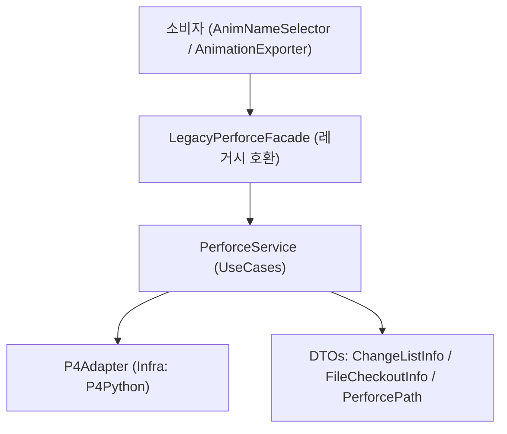

### PRD: PyJalLib Perforce 모듈 리팩토링

- 문서 버전: 0.3 (초안)
- 담당: [당신/나]
- 대상 모듈: `pyjallib/perforce.py`
- 주요 소비자: `20250627_AnimExporter/src/AnimNameSelector.py`, `orvlib/src/orvlib/max/animationExporter.py`

### 배경과 문제 정의
- 거대 단일 클래스: 1,000+ 라인의 단일 클래스에 연결/체인지리스트/파일/동기화/조회 로직 혼재.
- 반환/예외 처리 불일치: 일부는 예외, 일부는 `False`/빈 컬렉션 반환.
- 성능/안정성: 파일 단위 루프 호출 다수, 배치 호출 미활용, 경로 정규화/인코딩 처리 중복.
- 유지보수성 저하: 응집도/가독성 저하, 변경 영향 예측 어려움.
- 소비자 의존: `connect`, `create_change_list`, `checkout_files`, `add_files`, `submit_change_list`, `is_file_in_perforce`, `is_file_checked_out_by_others`, `check_files_checked_out`, `sync_files` 등에 강하게 의존.

### 목표와 비목표
- 목표
  - 안정성: 예외/에러 표준화, 가드/롤백 강화.
  - 단순성: 역할 분리 + 파사드로 사용성 유지.
  - 유지보수성: SOLID + Clean Architecture 기반 계층화.
  - 성능: Perforce 배치 API 기본화, 불필요 호출 최소화.
  - 호환성: 기존 공개 API 무중단 유지(Deprecated 경고는 후속 단계).
- 비목표
  - GUI/워크플로 기능 변경 없음.
  - Perforce 서버 설정/보안/권한 모델 변경 없음.
  - 다중 플랫폼 경로 처리 확대 없음. 경로 정규화는 Windows 경로만 고려.

### 요구사항
- 기능 요구사항
  - 연결 관리: 안전한 `connect`/`disconnect`, 컨텍스트 매니저 지원.
  - 체인지리스트: 생성/조회/편집/제출/되돌리기/빈 CL 삭제.
  - 연결 가드: 서비스 내부 단일 헬퍼 `require_connected()`로 처리. 모든 공개 메소드 시작부에서 호출.
  - 파일 작업: `checkout`/`add`/`delete`/`revert` (단일/배치).
  - 조회: 파일 Perforce 포함 여부, 체크아웃 상태(자신/타인), default CL 조회.
  - 동기화: 폴더 재귀/파일 리스트 동기화, `-n` 프리뷰 기반 업데이트 필요 여부.
  - 경로: 절대 경로 일관화, Windows 경로 표준화(`Path(...).resolve()` 후 백슬래시), 워크스페이스 루트 캐싱.
  - 제출 후 정리: 서밋 이후 “변경 없음”(unchanged) 파일은 서버 기능으로 자동 리버트.
    - `p4 revert -a -c <submitted_cl> //...`
    - `p4 revert -a -c default //...` (서밋 정책에 따라 default CL로 이동한 파일 포함 정리)
    - per-file `diff -sa` 기반 판정은 사용하지 않음.
- 비기능 요구사항
  - 예외 표준화: `PerforceError(code, message, detail)` 일원화, `ValidationError` 유지.
  - 로깅: `pyjallib.logger` 연동, 구조화 로그, P4 `errors/warnings` 캡처.
  - 성능: 가능한 모든 API를 배치 호출로 처리.
  - 테스트: Mock 기반 단위 테스트 + 선택적 통합 훅. I/O 의존성 최소화.
  - 가시성: 주요 API 시작/종료/예외 로깅.
  - 코드 가이드: Private 메소드 최소화(불가피한 단순 로직만). 의도별 공개 메소드 중심. 변환/중복 로직은 모듈 함수로 분리.
  - 상태 판단 정책: 예외에 의존하지 않고 구조화 결과를 우선 사용. Adapter 초기화 시 `p4.exception_level = 1`로 경고성 메시지를 예외로 승격하지 않음.

### 아키텍처 제안 (Clean Architecture + SOLID)

- PerforceService: 유스케이스 집합(배치/검증/에러정책/경로정규화).
- P4Adapter: P4Python 호출 캡슐화, 예외/인코딩/Windows 경로 변환 책임.
  - 초기화 시 `p4.exception_level = 1` 설정.
  - 상태 판단용 구조화 데이터 반환을 보장(`run_sync -n`, `run_opened`, `run_files`).
- LegacyPerforceFacade: 기존 클래스/시그니처 유지, 내부적으로 Service 위임.
- DTO: `ChangeListInfo`, `FileCheckoutInfo` 등 명확한 데이터 경계.

코딩/설계 가이드(Private 최소화)
- 공개 API는 의도 기반(체크아웃/추가/삭제/리버트/동기화/조회 등)으로 제공.
- Private 메소드는 불가피한 단순 로직에 한정하고, 가능한 경우 모듈 함수로 대체(`normalize_win_path`, 예외 매핑 등).
- 단일 파일 연산은 배치 메소드에 위임하여 공개 API를 일관화.

### API 설계(요약)
- 권장 신규 서비스 `PerforceService`
  - `connect(workspaceName) -> WorkspaceSession` (컨텍스트 매니저)
  - `is_connected: bool` (읽기 전용 상태 프로퍼티)
  - `require_connected() -> None` (연결 가드 헬퍼)
  - `get_pending_changelists() -> List[ChangeListInfo]`
  - `create_changelist(description) -> ChangeListInfo`
  - `edit_changelist(id, description?, addPaths?, removePaths?) -> ChangeListInfo`
  - `submit_changelist(id, autoRevertUnchanged=True) -> None`
  - `revert_changelist(id) -> None`
  - `delete_empty_changelist(id) -> None`
  - `checkout(paths, changelistId) -> None`
  - `add(paths, changelistId) -> None`
  - `delete(paths, changelistId) -> None`
  - `revert(paths, changelistId?) -> None`
  - `is_in_perforce(paths) -> Dict[path,bool]` (배치)
  - `get_checkout_status(paths, scope="current|all") -> Dict[path, FileCheckoutInfo]` (배치)
  - `sync(pathsOrDirs, preview=False) -> SyncResult`
  - `get_default_changelist() -> ChangeListInfo`
- 레거시 파사드 `Perforce` (시그니처 유지)
  - 기존 메소드명 유지(`connect`, `create_change_list`, `checkout_files`, `add_files`, `submit_change_list`, `is_file_in_perforce`, `is_file_checked_out_by_others`, `check_files_checked_out`, `sync_files`, ...)
  - 반환 타입/예외는 기존과 호환되도록 DTO→dict 변환.
  - 내부 연결 확인은 서비스의 `require_connected()` 호출로 처리. `_ensure_connected` 직접 호출 제거.

제출 로직 세부 정책
- `autoRevertUnchanged=True`일 때 다음을 수행:
  - `revert -a -c <id> //...`로 제출된 CL 내 변경 없음 파일 일괄 리버트.
  - `revert -a -c default //...`로 default CL에 남은 변경 없음 파일까지 일괄 리버트.
  - per-file `diff` 호출은 제거하여 환경/옵션에 따른 오탐을 방지.

의도별 배치 API와 레거시 헬퍼 제거
- `_file_op(command, file_path, cl, op_name)`는 Deprecated 후 제거.
- P4Adapter에 의도별 배치 메소드 제공:
  - `edit_files(paths, cl)`, `add_files(paths, cl)`, `delete_files(paths, cl)`, `revert_files(paths, cl?)`
- Service/Facade는 단일 파일 연산도 배치 메소드에 단일 리스트로 위임:
  - `checkout_file(p, cl)` → 내부적으로 `edit_files([p], cl)`
- `_ensure_connected` → 제거, `require_connected()`로 대체. `_is_connected` → `is_connected` 프로퍼티로 대체.
- 공통 에러 변환 유틸로 `P4Exception -> PerforceError` 일원화.

### 데이터 모델(DTO)
- `ChangeListInfo`
  - `id: Union[str,int]`, `description: str`, `status: "pending"|"submitted"`, `user: str`, `client: str`, `files: List[str]`
- `FileCheckoutInfo`
  - `isCheckedOut: bool`, `changeList: Optional[int]`, `action: Optional[str]`, `user: Optional[str]`, `client: Optional[str]`, `isCurrentUser: bool`, `isOthers: bool`

### 에러 처리 정책
- 모든 `P4Exception` → `PerforceError` 래핑, 표준 코드:
  - `NOT_CONNECTED`, `INVALID_ARGUMENT`, `ALREADY_UP_TO_DATE`, `NOTHING_TO_SUBMIT`, `FILE_NOT_FOUND`, `P4_SERVER_ERROR`, `ACCESS_DENIED`, `CONFLICT`
- 중립 시나리오(`up-to-date`, `nothing to submit`)는 성공/중립 처리. 예외로 던지지 않음.
- 재시도(옵션): 네트워크/일시적 오류에 지수 백오프 최대 3회(쓰기 연산은 기본 비활성화).
- 예외 의존 최소화: `run_sync('-n')` 반환의 `how`/`action` 등 구조화 필드로 업데이트 필요 여부 판정. `run_opened`의 `user/client/action/change`로 체크아웃 판정. `run_files` 결과 유무로 Perforce 포함 여부 판정.
- 문자열 메시지(`warnings/errors`)는 불가피할 때만 보조적으로 사용(로케일 차이 대비).

### 성능 최적화
- 배치 호출 기본화: `opened`, `files`, `sync`, `revert`, `edit/add/delete` 모두 리스트 입력 허용.
- 경로 정규화 1회 처리: Windows 전용 처리(`Path(path).resolve()` 후 백슬래시 정규화, 드라이브 대문자 유지).
- 워크스페이스 루트 캐싱 및 재사용.
- per-file `p4 diff -sa` 루프 제거, 서버의 `revert -a` 사용으로 O(N) 호출 축소.
- 문자열 기반 `command` 분기 제거(의도별 메소드로 치환).
- 연결 확인은 `require_connected()`로 일원화하여 분기/오버헤드 축소.

### 로깅/진단
- `pyjallib.logger` 통합:
  - `info`: 주요 API 시작/종료(파일 수, CL id, preview 여부 등).
  - `warning`: 중립 결과(업투데이트/노싱투서브밋) 및 폴백 처리.
  - `error`: `PerforceError(code, message, detail)`. P4 `errors/warnings` 필드 첨부.
- 호출 상관관계 ID(옵션)로 다중 배치 트래킹.

### 호환성 및 마이그레이션
- 단계적 이행:
  - 1단계: `LegacyPerforceFacade` 도입, 내부적으로 Service 위임. 소비자 변경 불필요.
  - 2단계: 신규 서비스 사용 가이드로 점진 전환, 레거시 API에 Deprecation 경고(로그)만 추가.
  - 3단계: 레거시 API 제거(합의 후).
- 소비자 영향/개선 포인트:
  - `is_file_in_perforce`/`check_files_checked_out` 배치판 사용으로 중복 호출 제거.
  - CL 일관성 검증을 배치 결과로 간소화.

### 테스트 전략
- 단위 테스트(Mock P4):
  - 성공/경고성 시나리오(업투데이트/노싱투서브밋) 검증.
  - 예외 래핑/코드 매핑, 배치 vs 단일 동등성.
  - Windows 경로 정규화 케이스(드라이브 문자/백슬래시/상대→절대).
  - 서밋 후 자동 리버트: 제출된 CL과 default CL에 대해 `revert -a`가 호출되고, 변경 없음 파일이 정리됨을 검증.
  - 상태 판단: `exception_level=1`에서 `run_sync('-n')`/`run_opened`/`run_files` 구조화 결과만으로 판정되는지 검증. 문자열 메시지는 사용하지 않음을 확인.
- 통합 테스트(옵션):
  - 샌드박스 워크스페이스로 기본 시나리오 실행 가능 훅 제공.

### 단계별 할 일 리스트
- 단계 1: 스켈레톤 및 인프라
  - `PerforceService`, `P4Adapter`, `LegacyPerforceFacade` 클래스 스켈레톤 추가.
  - 공통 예외/로그 유틸 연동(`PerforceError`, `ValidationError`, `pyjallib.logger`).
  - Windows 경로 유틸 도입: `normalize_win_path(path) -> str`.
  - 연결/해제, 워크스페이스 루트 캐싱 구현.
  - 서비스 내부 연결 가드 `require_connected()` 구현, 모든 공개 메소드에서 사용.
  - `_ensure_connected` Deprecated 표기 및 호출부 제거 계획 수립.
  - P4Adapter 초기화 시 `p4.exception_level = 1` 적용.
  - Private 메소드 목록 작성 및 처리 방안 수립(제거/공개 전환/모듈 함수화). 대상: `_file_op`, `_ensure_connected`, `_auto_revert_unchanged_files*`, `_is_connected`.

- 단계 2: 체인지리스트/파일 작업(배치 우선)
  - CL: 생성/조회/편집/삭제/되돌리기/제출 + `auto_revert_unchanged`(서버 `revert -a -c <id> //...` 및 `revert -a -c default //...` 적용).
  - 파일 작업: `checkout`/`add`/`delete`/`revert` 배치 구현.
  - 레거시 헬퍼 `_file_op` 제거 및 모든 호출부를 의도별 배치 메소드로 교체.
  - P4Adapter: `edit_files/add_files/delete_files/revert_files` 구현 및 Service/Facade 위임 연결.
  - 조회: `is_in_perforce(paths)`, `get_checkout_status(paths, scope)` 배치 구현.
  - 레거시 파사드 메소드 위임/DTO→dict 변환.
  - `_ensure_connected` 제거 및 모든 연결 검사 경로를 `require_connected()` 호출로 대체.
  - 상태 판단 로직 교체: 예외/문자열 기반 판정 제거 → 구조화 결과 기반으로 리팩토링.

- 단계 3: 동기화/프리뷰/보완
  - `sync(pathsOrDirs, preview)` 구현, 폴더 `...` 재귀 처리.
  - `check_update_required` 프리뷰 기반 단순화.
  - 중립 시나리오 표준화(업투데이트/노싱투서브밋) 및 로깅.
  - 기존 per-file `diff` 기반 보조 메소드 제거 또는 내부 비활성화.

- 단계 4: 안정화/테스트
  - 단위 테스트 구성(Mock P4, 경로 유틸, 배치/단일 동등성).
  - 소비자 리그레션 시나리오 스모크(단일/배치 익스포트, 저장/서브밋 루트).
  - 로그 품질 점검 및 필드 정제.

### 오픈 이슈
- 배치 최대 크기/타임아웃 정책(서버 설정 의존) 결정 필요.
- `auto_revert_unchanged` 기본값 유지 여부.
- 이벤트 훅(콜러블 vs 시그널) 구체 인터페이스.