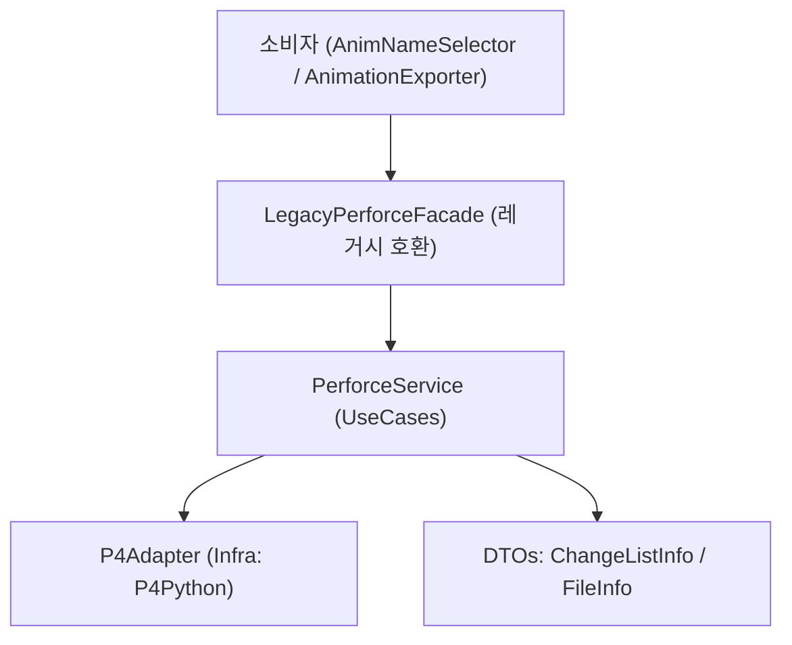

### PRD: PyJalLib Perforce 모듈 리팩토링

- 문서 버전: 0.3 (초안)
- 담당: [당신/나]
- 대상 모듈: `pyjallib/perforce.py`
- 주요 소비자: `20250627_AnimExporter/src/AnimNameSelector.py`, `orvlib/src/orvlib/max/animationExporter.py`

### 이 문서를 읽는 법(요약)
- 목적/범위: Perforce 모듈을 안정·단순·배치 우선 구조로 리팩토링하고, 레거시 호환을 유지
- 핵심 산출물: `perforce.py`(레거시 파사드 유지), `perforceCore/`(신규 Adapter/Service/DTO)
- 필수 원칙: 로깅 금지(예외/DTO만), Windows 경로만, 구조화 결과 기반 상태 판정, 배치 우선, Private 최소화
- 마이그레이션: 레거시 API는 유지하되 내부 위임. 신규 API는 `pyjallib.perforceCore` 사용

### 핵심 결정 요약(키 포인트)
- 새 패키지: `pyjallib/perforceCore/` (외부 `p4` 충돌 회피)
- 레거시 유지: `pyjallib/perforce.py`는 Facade로 존치, 내부적으로 Service 위임
- DTO 통일: 파일 관련 정보는 `FileInfo` 하나로 통합
- 상태 판정: 예외 대신 구조화 결과(`run_sync -n`, `run_opened`, `run_files`) 우선, `exception_level=1`
- 제출 후 정리: `revert -a -c <id>`, `revert -a -c default`로 서버에 위임
- 로깅 금지: 모듈은 로깅하지 않으며, 호출자가 로깅 담당
- Windows 전용 경로: 절대경로/백슬래시/드라이브 대문자
- Local-only/Not-in-view: 모든 작업에서 스킵(ADD만 예외적으로 view 매핑 시 허용)
- 연결 가드: `require_connected()`로 일원화
- Private 최소화: 인프라(Adapter) 내부의 필수 프라이빗만 허용

### 배경과 문제 정의
- 거대 단일 클래스: 1,000+ 라인의 단일 클래스에 연결/체인지리스트/파일/동기화/조회 로직 혼재.
- 반환/예외 처리 불일치: 일부는 예외, 일부는 `False`/빈 컬렉션 반환.
- 성능/안정성: 파일 단위 루프 호출 다수, 배치 호출 미활용, 경로 정규화/인코딩 처리 중복.
- 유지보수성 저하: 응집도/가독성 저하, 변경 영향 예측 어려움.
- 소비자 의존: `connect`, `create_change_list`, `checkout_files`, `add_files`, `submit_change_list`, `is_file_in_perforce`, `is_file_checked_out_by_others`, `check_files_checked_out`, `sync_files` 등에 강하게 의존.

### 목표와 비목표
- 목표
  - 안정성: 예외/에러 표준화, 가드/롤백 강화.
  - 단순성: 역할 분리 + 파사드로 사용성 유지.
  - 유지보수성: SOLID + Clean Architecture 기반 계층화.
  - 성능: Perforce 배치 API 기본화, 불필요 호출 최소화.
  - 호환성: 기존 공개 API 무중단 유지(Deprecated 경고는 후속 단계).
- 비목표
  - GUI/워크플로 기능 변경 없음.
  - Perforce 서버 설정/보안/권한 모델 변경 없음.
  - 다중 플랫폼 경로 처리 확대 없음. 경로 정규화는 Windows 경로만 고려.

### 요구사항
- 기능 요구사항
  - 연결 관리: 안전한 `connect`/`disconnect`, 컨텍스트 매니저 지원.
  - 체인지리스트: 생성/조회/편집/제출/되돌리기/빈 CL 삭제.
  - 연결 가드: 서비스 내부 단일 헬퍼 `require_connected()`로 처리. 모든 공개 메소드 시작부에서 호출.
  - 파일 작업: `checkout`/`add`/`delete`/`revert` (단일/배치).
    - 모든 변경 작업(`checkout/add/delete/revert/submit/sync`)은 프리플라이트 `is_in_perforce(paths)` 필터를 통과한 경로만 처리.
    - 예외 규칙(ADD): `inPerforce=False`이면서 "클라이언트 뷰에 매핑됨"인 경로만 `add` 허용. 뷰 미매핑은 스킵.
  - 조회: 파일 Perforce 포함 여부, 체크아웃 상태(자신/타인), default CL 조회.
  - 동기화: 폴더 재귀/파일 리스트 동기화, `-n` 프리뷰 기반 업데이트 필요 여부.
    - 입력 경로 중 Perforce에 없는 로컬 전용 파일은 자동 추가하지 않고 건너뜀.
    - 건너뛴 파일은 `sync()` 반환 `FileInfo` 목록에서 `skippedReason`으로 표시(`NOT_IN_PERFORCE`/`NOT_IN_VIEW`).
    - 자동 추가/제출은 별도의 명시적 플로우에서만 수행(동기화 시 자동 add 금지).
  - 경로: 절대 경로 일관화, Windows 경로 표준화(`Path(...).resolve()` 후 백슬래시), 워크스페이스 루트 캐싱.
  - 제출 후 정리: 서밋 이후 “변경 없음”(unchanged) 파일은 서버 기능으로 자동 리버트.
    - `p4 revert -a -c <submitted_cl> //...`
    - `p4 revert -a -c default //...` (서밋 정책에 따라 default CL로 이동한 파일 포함 정리)
    - per-file `diff -sa` 기반 판정은 사용하지 않음.
- 비기능 요구사항
  - 예외 표준화: `PerforceError(code, message, detail)` 일원화, `ValidationError` 유지.
  - 로깅 금지: Perforce 모듈은 `pyjallib.logger` 등 어떤 로깅도 직접 호출하지 않음. 경고/메타 정보는 DTO(`FileInfo.warnings`)로만 전달, 에러는 예외로만 신호.
  - 성능: 가능한 모든 API를 배치 호출로 처리.
  - 테스트: Mock 기반 단위 테스트 + 선택적 통합 훅. I/O 의존성 최소화.
  - 가시성: 호출자가 로깅을 담당. 모듈은 결과/경고/예외만 일관되게 반환.
  - 코드 가이드: Private 메소드 최소화(불가피한 단순 로직만). 의도별 공개 메소드 중심. 변환/중복 로직은 Adapter 내부 프라이빗으로 캡슐화.
  - 상태 판단 정책: 예외에 의존하지 않고 구조화 결과를 우선 사용. Adapter 초기화 시 `p4.exception_level = 1`로 경고성 메시지를 예외로 승격하지 않음.
  - `is_in_perforce(paths)`는 내부적으로 `run_files` + `where`를 조합하여 Perforce 포함 여부와 뷰 매핑 여부를 함께 판정.

### 아키텍처 제안 (Clean Architecture + SOLID)


- PerforceService: 유스케이스 집합(배치/검증/에러정책/경로정규화).
- P4Adapter: P4Python 호출 캡슐화, 예외/인코딩/Windows 경로 변환 책임.
  - 초기화 시 `p4.exception_level = 1` 설정.
  - 상태 판단용 구조화 데이터 반환을 보장(`run_sync -n`, `run_opened`, `run_files`).
- LegacyPerforceFacade: 기존 클래스/시그니처 유지, 내부적으로 Service 위임.
- DTO: `ChangeListInfo`, `FileCheckoutInfo` 등 명확한 데이터 경계.

코딩/설계 가이드(Private 최소화)
- 공개 API는 의도 기반(체크아웃/추가/삭제/리버트/동기화/조회 등)으로 제공.
- Private 메소드는 불가피한 단순 로직에 한정하고, 인프라 계층(Adapter) 내부 프라이빗 메소드로 캡슐화(`_normalize_win_path`, 예외 매핑 등).
- 단일 파일 연산은 배치 메소드에 위임하여 공개 API를 일관화.

### API 설계(요약)
- 권장 신규 서비스 `PerforceService`
  - `connect(workspaceName) -> WorkspaceSession` (컨텍스트 매니저)
  - `is_connected: bool` (읽기 전용 상태 프로퍼티)
  - `require_connected() -> None` (연결 가드 헬퍼)
  - `get_pending_changelists() -> List[ChangeListInfo]`
  - `create_changelist(description) -> ChangeListInfo`
  - `edit_changelist(id, description?, addPaths?, removePaths?) -> ChangeListInfo`
  - `submit_changelist(id, autoRevertUnchanged=True) -> None`
  - `revert_changelist(id) -> None`
  - `delete_empty_changelists() -> None`
  - `checkout(paths, changelistId) -> None`
  - `add(paths, changelistId) -> None`
  - `delete(paths, changelistId) -> None`
  - `revert(paths, changelistId?) -> None`
  - `is_in_perforce(paths) -> Dict[path,bool]` (배치)
  - `get_checkout_status(paths, scope="current|all") -> Dict[path, FileInfo]` (배치)
  - `sync(pathsOrDirs, preview=False) -> List[FileInfo]`
  - `get_default_changelist() -> ChangeListInfo`
- 레거시 파사드 `Perforce` (시그니처 유지)
  - 기존 메소드명 유지(`connect`, `create_change_list`, `checkout_files`, `add_files`, `submit_change_list`, `is_file_in_perforce`, `is_file_checked_out_by_others`, `check_files_checked_out`, `sync_files`, ...)
  - 반환 타입/예외는 기존과 호환되도록 DTO→dict 변환.
  - 내부 연결 확인은 서비스의 `require_connected()` 호출로 처리. `_ensure_connected` 직접 호출 제거.

제출 로직 세부 정책
- `autoRevertUnchanged=True`일 때 다음을 수행:
  - `revert -a -c <id> //...`로 제출된 CL 내 변경 없음 파일 일괄 리버트.
  - `revert -a -c default //...`로 default CL에 남은 변경 없음 파일까지 일괄 리버트.
  - per-file `diff` 호출은 제거하여 환경/옵션에 따른 오탐을 방지.

의도별 배치 API와 레거시 헬퍼 제거
- `_file_op(command, file_path, cl, op_name)`는 Deprecated 후 제거.
- P4Adapter에 의도별 배치 메소드 제공:
  - `edit_files(paths, cl)`, `add_files(paths, cl)`, `delete_files(paths, cl)`, `revert_files(paths, cl?)`
- Service/Facade는 단일 파일 연산도 배치 메소드에 단일 리스트로 위임:
  - `checkout_file(p, cl)` → 내부적으로 `edit_files([p], cl)`
- `_ensure_connected` → 제거, `require_connected()`로 대체. `_is_connected` → `is_connected` 프로퍼티로 대체.
- 공통 에러 변환 유틸로 `P4Exception -> PerforceError` 일원화.

### 데이터 모델(DTO)
- `ChangeListInfo`
  - `id: Union[str,int]`, `description: str`, `status: "pending"|"submitted"`, `user: str`, `client: str`, `files: List[str]`
- `FileInfo` (파일 관련 공통 DTO, 조회/동기화 모두에 사용)
  - `path: str` (Windows 절대경로)
  - `inPerforce: bool`
  - `isCheckedOut: bool`
  - `changeList: Optional[int]`
  - `action: Optional[str]`
  - `user: Optional[str]`
  - `client: Optional[str]`
  - `isCurrentUser: bool`
  - `isOthers: bool`
  - `syncNeeded: Optional[bool]`
  - `syncPerformed: Optional[bool]`
  - `skippedReason: Optional[str]` (예: "NOT_IN_PERFORCE", "NOT_FOUND_IN_VIEW")
  - `warnings: List[str]`

### 에러 처리 정책
- 모든 `P4Exception` → `PerforceError` 래핑, 표준 코드:
  - `NOT_CONNECTED`, `INVALID_ARGUMENT`, `ALREADY_UP_TO_DATE`, `NOTHING_TO_SUBMIT`, `FILE_NOT_FOUND`, `P4_SERVER_ERROR`, `ACCESS_DENIED`, `CONFLICT`
- 중립 시나리오(`up-to-date`, `nothing to submit`)는 성공/중립 처리. 예외로 던지지 않음.
- 재시도(옵션): 네트워크/일시적 오류에 지수 백오프 최대 3회(쓰기 연산은 기본 비활성화).
- 예외 의존 최소화: `run_sync('-n')` 반환의 `how`/`action` 등 구조화 필드로 업데이트 필요 여부 판정. `run_opened`의 `user/client/action/change`로 체크아웃 판정. `run_files` 결과 유무로 Perforce 포함 여부 판정.
- 문자열 메시지(`warnings/errors`)는 불가피할 때만 보조적으로 사용(로케일 차이 대비).

### 성능 최적화
- 배치 호출 기본화: `opened`, `files`, `sync`, `revert`, `edit/add/delete` 모두 리스트 입력 허용.
- 경로 정규화 1회 처리: Windows 전용 처리(`Path(path).resolve()` 후 백슬래시 정규화, 드라이브 대문자 유지).
- 워크스페이스 루트 캐싱 및 재사용.
- per-file `p4 diff -sa` 루프 제거, 서버의 `revert -a` 사용으로 O(N) 호출 축소.
- 문자열 기반 `command` 분기 제거(의도별 메소드로 치환).
- 연결 확인은 `require_connected()`로 일원화하여 분기/오버헤드 축소.

### 로깅/진단
- 모듈 내부 로깅 금지 원칙:
  - Perforce 모듈은 로깅을 수행하지 않으며, 호출자가 로깅을 결정.
  - 경고/진단 정보는 DTO의 `warnings`/`skippedReason` 등 필드로 전달.
  - 오류는 `PerforceError` 예외로만 노출. 예외 메시지에 P4 `errors/warnings`를 포함해 호출자 로깅을 돕는다.

### 호환성 및 마이그레이션
- 단계적 이행:
  - 1단계: `LegacyPerforceFacade` 도입, 내부적으로 Service 위임. 소비자 변경 불필요.
  - 2단계: 신규 서비스 사용 가이드로 점진 전환, 레거시 API에 Deprecation 경고(로그)만 추가.
  - 3단계: 레거시 API 제거(합의 후).
- 소비자 영향/개선 포인트:
  - `is_file_in_perforce`/`check_files_checked_out` 배치판 사용으로 중복 호출 제거.
  - CL 일관성 검증을 배치 결과로 간소화.

### 테스트 전략
- 단위 테스트(Mock P4):
  - 성공/경고성 시나리오(업투데이트/노싱투서브밋) 검증.
  - 예외 래핑/코드 매핑, 배치 vs 단일 동등성.
  - Windows 경로 정규화 케이스(드라이브 문자/백슬래시/상대→절대).
  - 서밋 후 자동 리버트: 제출된 CL과 default CL에 대해 `revert -a`가 호출되고, 변경 없음 파일이 정리됨을 검증.
  - 상태 판단: `exception_level=1`에서 `run_sync('-n')`/`run_opened`/`run_files` 구조화 결과만으로 판정되는지 검증. 문자열 메시지는 사용하지 않음을 확인.
- 통합 테스트(옵션):
  - 샌드박스 워크스페이스로 기본 시나리오 실행 가능 훅 제공.

### 단계별 할 일 리스트
- 단계 1: 스켈레톤 및 인프라
  - `PerforceService`, `P4Adapter`, `LegacyPerforceFacade` 클래스 스켈레톤 추가.
  - 공통 예외/로그 유틸 연동(`PerforceError`, `ValidationError`, `pyjallib.logger`).
  - Windows 경로 유틸 도입: `normalize_win_path(path) -> str`.
  - 연결/해제, 워크스페이스 루트 캐싱 구현.
  - 서비스 내부 연결 가드 `require_connected()` 구현, 모든 공개 메소드에서 사용.
  - `_ensure_connected` Deprecated 표기 및 호출부 제거 계획 수립.
  - P4Adapter 초기화 시 `p4.exception_level = 1` 적용.
  - Private 메소드 목록 작성 및 처리 방안 수립(제거/공개 전환/모듈 함수화). 대상: `_file_op`, `_ensure_connected`, `_auto_revert_unchanged_files*`, `_is_connected`.
  - 새 패키지 확정: `pyjallib.perforceCore`에 Adapter/Service/DTO 구현. 레거시 `pyjallib.perforce`는 Facade만 유지.

- 단계 2: 체인지리스트/파일 작업(배치 우선)
  - CL: 생성/조회/편집/삭제/되돌리기/제출 + `auto_revert_unchanged`(서버 `revert -a -c <id> //...` 및 `revert -a -c default //...` 적용).
  - 파일 작업: `checkout`/`add`/`delete`/`revert` 배치 구현.
  - 레거시 헬퍼 `_file_op` 제거 및 모든 호출부를 의도별 배치 메소드로 교체.
  - P4Adapter: `edit_files/add_files/delete_files/revert_files` 구현 및 Service/Facade 위임 연결.
  - 조회: `is_in_perforce(paths)`, `get_checkout_status(paths, scope)` 배치 구현.
  - 레거시 파사드 메소드 위임/DTO→dict 변환.
  - `_ensure_connected` 제거 및 모든 연결 검사 경로를 `require_connected()` 호출로 대체.
  - 상태 판단 로직 교체: 예외/문자열 기반 판정 제거 → 구조화 결과 기반으로 리팩토링.
  - 임포트 경로 검증: 기존 툴에서 `import pyjallib.perforce`는 그대로 동작, 신규는 `pyjallib.perforceCore` 사용.

- 단계 3: 동기화/프리뷰/보완
  - `sync(pathsOrDirs, preview)` 구현, 폴더 `...` 재귀 처리.
  - `check_update_required` 프리뷰 기반 단순화.
  - 중립 시나리오 표준화(업투데이트/노싱투서브밋) 및 로깅.
  - 기존 per-file `diff` 기반 보조 메소드 제거 또는 내부 비활성화.

- 단계 4: 안정화/테스트
  - 단위 테스트 구성(Mock P4, 경로 유틸, 배치/단일 동등성).
  - 소비자 리그레션 시나리오 스모크(단일/배치 익스포트, 저장/서브밋 루트).
  - 로그 품질 점검 및 필드 정제.

### 오픈 이슈
- 배치 최대 크기/타임아웃 정책(서버 설정 의존) 결정 필요.
- `auto_revert_unchanged` 기본값 유지 여부.
- 이벤트 훅(콜러블 vs 시그널) 구체 인터페이스.


### 파일/클래스 구성(제안)
```
PyJalLib/src/pyjallib/
  perforce.py                            # LegacyPerforceFacade (레거시 호환 API)
  perforceCore/
    __init__.py
    adapter.py                           # class P4Adapter
    service.py                           # class PerforceService
    dtos.py                              # ChangeListInfo, FileInfo
    # 상수/타입 파일 없음: 기본값은 adapter/service 인스턴스 속성으로 보관

# 재사용 파일(신규 생성 아님)
PyJalLib/src/pyjallib/exceptions.py      # PerforceError, ValidationError
PyJalLib/src/pyjallib/logger.py          # 구조화 로깅

# 테스트 (제안)
PyJalLib/tests/perforce/
  test_service_basic.py
  test_adapter_calls.py
  test_status_determination.py
  test_submit_and_revert.py
```

임포트 예시(개발자 가이드 짧은 예)
```python
# 레거시 호환 (변경 없음)
from pyjallib import perforce
p4 = perforce.Perforce()

# 신규 API 사용
from pyjallib.perforceCore.service import PerforceService
from pyjallib.perforceCore.adapter import P4Adapter

adapter = P4Adapter()
service = PerforceService(adapter, autoRevertUnchanged=True)
service.connect("MyWorkspace")
files = service.sync([r"D:\\DevStorage\\Project\\..."] , preview=False)
```

### 부록 A. 어댑터/서비스 API 계약(요약)
- P4Adapter
  - 설정: `exception_level=1`, 서버/클라이언트/유저 속성 노출(readonly)
  - 속성(attributes): `exception_level`(int, 기본 1), `batchMax`(int, 기본 200)
  - 메소드: `run_edit(paths, cl)`, `run_add(paths, cl)`, `run_delete(paths, cl)`, `run_revert(paths, cl?)`, `run_opened(pathsOrFilter, allUsers=False)`, `run_files(pathOrPaths)`, `run_sync(pathsOrDirs, preview=False)`, `run_change_fetch(id)`, `run_change_create(spec)`, `run_change_save(spec)`, `run_change_delete(id)`, `run_submit(cl)`, `run_where(pathOrPaths)`
  - 내부 프라이빗: `_normalize_win_path(path)`, `_run_safely(call, *args, **kwargs)`, `_parse_opened_entry(entry, current_user, client)`, `_is_in_client_view(path)`, `_chunk_batch(iterable, size)`, `_summarize_paths(paths, limit=5)`
  - 경로: 모든 인수는 Windows 절대경로, 내부에서 `_normalize_win_path()` 적용

- PerforceService
  - 가드: 모든 공개 메소드 시작부 `require_connected()`
  - 속성(attributes): `autoRevertUnchanged`(bool, 기본 True)
  - 상태 조회: `get_checkout_status(paths, scope='current|all')`, `is_in_perforce(paths)`
  - 파일: `checkout/add/delete/revert` (모두 배치)
  - CL: `create/edit/submit/revert/delete_empties/get_pending/get_default`
  - 동기화: `sync(pathsOrDirs, preview=False)`, `check_update_required(pathsOrDirs)`

### 부록 B. DTO 상세
- ChangeListInfo: `{ id, description, status, user, client, files[] }`
- FileInfo: `{ path, inPerforce, isCheckedOut, changeList?, action?, user?, client?, isCurrentUser, isOthers, syncNeeded?, syncPerformed?, skippedReason?, warnings[] }`

### 부록 C. 에러 코드 설명(요약)
- NOT_CONNECTED: 연결 전 API 호출
- INVALID_ARGUMENT: 경로/입력 타입/상태 불일치
- ALREADY_UP_TO_DATE: 동기화 프리뷰 결과 업데이트 불필요
- NOTHING_TO_SUBMIT: 제출할 파일 없음
- FILE_NOT_FOUND: Perforce 상의 파일 미존재
- ACCESS_DENIED: 권한/락/보안 정책 위반
- P4_SERVER_ERROR: 서버/네트워크 오류
- CONFLICT: 충돌/다중 체크아웃 정책 위반 등

### 부록 D. 로깅 필드(권장)
- `event`, `changelistId`, `numFiles`, `pathsSample`(최대 5개), `scope`(current|all), `preview`(bool), `durationMs`, `resultCode`, `warningCount`, `errorCount`

### 부록 E. 레거시→신규 매핑
- `checkout_file(s)` → `service.checkout(paths, cl)`
- `add_file(s)` → `service.add(paths, cl)`
- `delete_file(s)` → `service.delete(paths, cl)`
- `revert_file(s)` → `service.revert(paths, cl)`
- `is_file_in_perforce` → `service.is_in_perforce([path])`
- `check_files_checked_out(_all_users)` → `service.get_checkout_status(paths, scope)` (반환 타입: `Dict[path, FileInfo]`)
- `submit_change_list` → `service.submit_changelist(id, autoRevertUnchanged=True)`
- `check_update_required` → `service.check_update_required(pathsOrDirs)`
- `sync_files` → `service.sync(pathsOrDirs, preview=False)` (반환 타입: `List[FileInfo]`)

### 부록 F. 플래그/환경 설정(권장 값)
- `autoRevertUnchanged=True`
- `exception_level=1`
- `batchMax=200`(서버에 따라 조정)
- `sync.preview=true`(상태 판단 시)

### 부록 G. 테스트 케이스 체크리스트(추가)
- opened: current/all 구분, 다중 사용자 체크아웃 포함
- sync -n: 업데이트 필요/불필요/부분 업데이트 혼합
- files: 존재/미존재/경로 정규화 케이스(대소문자/슬래시)
- submit: nothing-to-submit/성공 후 `revert -a` default 동작
- revert: 특정 CL/기본 CL 동시 처리
- 오류: 네트워크 일시 오류 재시도, 권한 오류 즉시 실패

### 부록 H. 클래스별 메소드 목록(초안)
- LegacyPerforceFacade (`pyjallib/perforce.py`)
  - `connect(workspace_name)`
  - `disconnect()`
  - `get_pending_change_list()`
  - `create_change_list(description)`
  - `get_change_list_by_number(change_list_number)`
  - `get_change_list_by_description(description)` (Deprecated 예정)
  - `get_change_list_by_description_pattern(description_pattern, exact_match=False)` (Deprecated 예정)
  - `edit_change_list(change_list_number, description=None, add_file_paths=None, remove_file_paths=None)`
  - `submit_change_list(change_list_number, auto_revert_unchanged=True)`
  - `revert_change_list(change_list_number)`
  - `delete_empty_change_list(change_list_number)`
  - `get_default_change_list()`
  - `checkout_file(file_path, change_list_number)` / `checkout_files(file_paths, change_list_number)` (Deprecated 예정: 단일 파일 메소드)
  - `add_file(file_path, change_list_number)` / `add_files(file_paths, change_list_number)` (Deprecated 예정: 단일 파일 메소드)
  - `delete_file(file_path, change_list_number)` / `delete_files(file_paths, change_list_number)` (Deprecated 예정: 단일 파일 메소드)
  - `revert_file(file_path, change_list_number)` / `revert_files(change_list_number, file_paths)` (Deprecated 예정: 단일 파일 메소드)
  - `check_files_checked_out(file_paths)` (Deprecated 예정)
  - `check_files_checked_out_all_users(file_paths)` (Deprecated 예정)
  - `get_file_checkout_info_all_users(file_path)` (Deprecated 예정)
  - `get_files_checked_out_by_others(file_paths)`
  - `is_file_checked_out(file_path)` (Deprecated 예정)
  - `is_file_checked_out_by_others(file_path)`
  - `is_file_in_pending_changelist(file_path, change_list_number)` (Deprecated 예정)
  - `is_file_in_perforce(file_path)`
  - `check_update_required(file_paths)` (Deprecated 예정)
  - `sync_files(file_paths)`

- PerforceService (`pyjallib/perforce/service.py`)
  - `connect(workspace_name)`
  - `disconnect()`
  - `require_connected()`
  - `get_pending_changelists()`
  - `create_changelist(description)`
  - `get_changelist_by_number(changelist_id)`
  - `get_changelist_by_description(description)`
  - `get_changelists_by_description_pattern(description_pattern, exact_match=False)`
  - `edit_changelist(changelist_id, description=None, add_paths=None, remove_paths=None)`
  - `submit_changelist(changelist_id, auto_revert_unchanged=True)`
  - `revert_changelist(changelist_id)`
  - `delete_empty_changelists()`
  - `get_default_changelist()`
  - `is_in_perforce(paths)`
  - `get_checkout_status(paths, scope='current')` / `get_checkout_status(paths, scope='all')`
  - `checkout(paths, changelist_id)`
  - `add(paths, changelist_id)`
  - `delete(paths, changelist_id)`
  - `revert(paths, changelist_id=None)`
  - `sync(paths_or_dirs, preview=False)`
  - `check_update_required(paths_or_dirs)`
  - `get_files_checked_out_by_others(paths)`
  - `get_file_checkout_info_all_users(path)`
  - `is_file_checked_out_by_others(path)`

- P4Adapter (`pyjallib/perforce/adapter.py`)
  - `connect(client_name)`
  - `disconnect()`
  - `run_edit(paths, changelist_id)`
  - `run_add(paths, changelist_id)`
  - `run_delete(paths, changelist_id)`
  - `run_revert(paths, changelist_id=None)`
  - `run_opened(paths_or_filter, all_users=False)`
  - `run_files(path_or_paths)`
  - `run_sync(paths_or_dirs, preview=False)`
  - `run_change_fetch(changelist_id)`
  - `run_change_create(spec)`
  - `run_change_save(spec)`
  - `run_change_delete(changelist_id)`
  - `run_submit(changelist_id)`
  - `run_where(path_or_paths)`